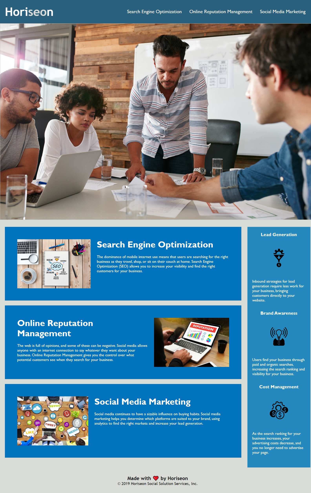

# Horiseon - Marketing and Lead Generation

## Description

The aim of this project is to refactor and consolidate code provided, so as to improve accessbility for end users as well as to keep code clean for potential future development. Accessibilty has very important implications for search engine effectiveness, as well as making sure the project is inclusive to all end users, for example those with screen readers.

Refactoring the code in this project includes making HTML semantic where possible, including alt descriptions of images, search engine optmisation such as a title and appropriate HTML tags, and consolidation of CSS code to make reviewing code as sleek as possible, among other things.

## Installation

To install this project onto your own computer and review the code, simply clone the repository to a local folder. To view live deployment of this project on Github pages, [click here](https://tg-ivy.github.io/thomas-marketing-site/).

Here is a screenshot of the live project:

## License

This repo uses a standard MIT license. For more info on this license, refer to the license file, or [click here](https://choosealicense.com/licenses/mit/).